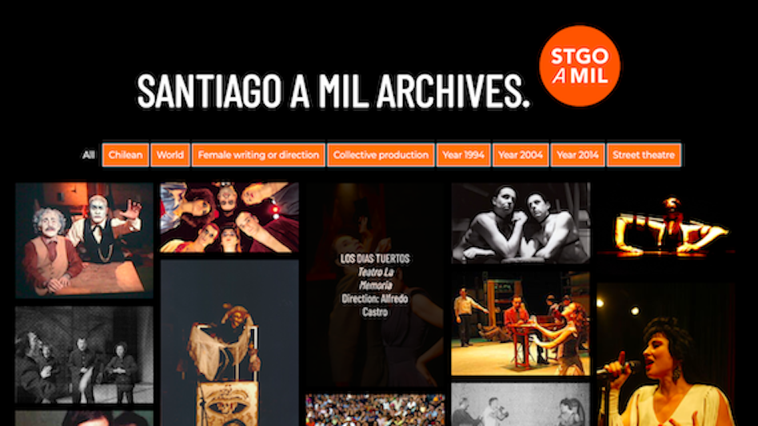

# Santiago-a-1000-Archives
## Description
The archive "Santiago a Mil" is a website through which it is possible to find an index of  plays that were on billboard during the 1994, 2004 and 2014 seasons, at the Santiago Theatre Festival that takes place every January since 1994.

Though the user's interaction, this web-page filters the plays based upon nine criteria: 
* All plays
* Chilean (for national works)
* World (for international works)
* Female writing or direction
* Collective productions
* Year:  
      1994  
      2004  
      2014  
* Street theatre.

The website was built on HTML, CSS and JavaScript's libraries JQuery and Isotope, allowing the filter of items on the website. All of them are included and available to download from this repository.
This project was developed as part of the course "Publication Numérique" class by prof. Isaac Pante at the University of Lausanne - Autumn 2019-2020.

